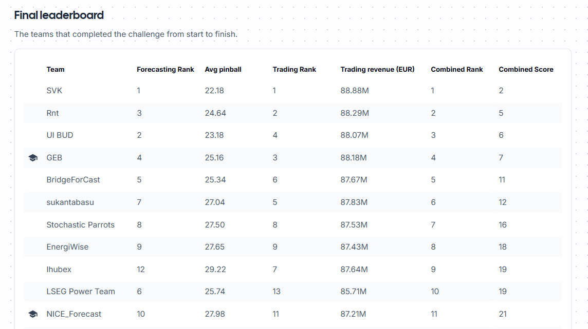

# HEFTCom2024: Probabilistic Energy Forecasting and Trading Competition


This repository contains the code used in the paper **"A Hybrid Strategy for Probabilistic Forecasting and Trading of Aggregated Wind–Solar Power: Design and Analysis in HEFTCom2024"**, which details the solutions developed by Team GEB for the [Hybrid Energy Forecasting and Trading Competition 2024 (HEFTCom2024)](https://ieee-dataport.org/competitions/hybrid-energy-forecasting-and-trading-competition). Our solutions provide accurate probabilistic forecasts for a hybrid power plant and achieving significant trading revenue.


## Final Rank

In the final leaderboard of HEFTCom2024, the team GEB achieved:

- 🥇 1st place among student teams in the Combined Track.

- 🥉 3rd place overall in the Trading Track.

- 🎖 4th place overall in the Forecasting Track.



## Overview

The codebase is structured to reproduce the methodologies described in the paper:

1. **Combined Sister Models** trained on various Numerical Weather Predictions (NWPs) for wind power forecasting.
2. **Online Post-Processing** model to address distribution shifts caused by increased solar capacity in the online test set.
3. **Probabilistic Aggregation** technique to provide accurate quantile forecasts of total hybrid generation.
4. **Stochastic Trading Strategy** to maximize expected trading revenue considering uncertainties in electricity prices.
5. **End-to-End Learning in Trading** to further enhance the revenue.

## Project Structure

- 📂 **data** — Data-related contents

  - 📂 **best_params** — Best tuned parameters
  - 📂 **dataset** — Training and testing datasets
    - 📂 **full** — Full HEFTCom offline datasets (Case 2 training)
      - 📂 **dwd** — DWD source data
      - 📂 **gfs** — GFS source data
    - 📂 **latest** — HEFTCom online dataset (Case 2 test)
    - 📂 **test** — Test set (Case 1 test)
    - 📂 **train** — Training set (Case 1 training)
  - 📂 **raw** — Raw data provided by HEFTCom organizers
  - 📂 **revenues** — Revenue results from trading tests
    - 📂 **case1**
    - 📂 **case2**

- 📂 **data_analys** — Data analysis scripts/results
- 📂 **figs** — Figures and visualizations
- 📂 **models** — Model storage
  - 📂 **benchmark/train** — Direct total forecasting (wind+solar) benchmark
  - 📂 **Ensemble** — Ensemble (wind/solar) models
  - 📂 **LGBM** — LightGBM models
  - 📂 **Prices** — Price-related models/data
  - 📂 **Rolling_PostProcess** — Rolling post-processing (Forecasting/Trading) models
- 📂 **pre-process** — Data preprocessing scripts
- 📂 **slides** — Slides for reports/presentations
- 📂 **test** — Testing scripts
- 📂 **train** — Training scripts

- 📄 **utils_data.py** — Data processing utilities
- 📄 **utils_e2e.py** — End-to-end learning utilities for trading
- 📄 **utils_forecasting.py** — Forecasting utilities
- 📄 **utils.py** — General utilities

## Usage

### Create the Environment

```bash
conda env create -f environment.yml
conda activate HEFTCom24
```

### Data Preparation

1. Download competition data from [IEEE Dataport](https://ieee-dataport.org/competitions/hybrid-energy-forecasting-and-trading-competition).

2. Place the downloaded data in `data/raw/` directory.

### Data Preprocessing Pipeline

```bash
# Data normalization, feature engineering,  dataset generation for historical/latest scenarios
cd pre-process
python dataPreProcess.py
```

### Model Development

```bash
#Train LightGBM models for dense quantile regression
cd train
python train/train.py

#Train total generation forecasting model
python train/train_total_stacking.py

#Train the stacked multi-source NWPs sister forecasting model
python stacking.py
```

**Note：** It is necessary to train multiple models corresponding to different quantiles (0.1, 1, 2, …, 99, 99.9) from different NWPs (DWD and GFS), and to train them separately for different data periods (cases). As a result, the model development process **may take several hours**. Pre-trained models are provided in the Release Code for direct testing.

### Experimental Validation

| Component                 | Validation Scripts                                          | Metrics                           | Corresponding Results in Paper |
| ------------------------- | ----------------------------------------------------------- | --------------------------------- | ------------------------------ |
| Wind Forecasting Ensemble | `test/test_ensemble.py`                                     | Pinball Loss, CRPS, Winkler Score | Table 2                        |
| Solar Post-Processing     | `test/test_solar_online.py`                                 | Pinball Loss, CRPS, Winkler Score | Table 3, Figure 6              |
| Probabilistic Aggregation | `test/test_aggregation.py`                                  | Pinball Loss, CRPS, Winkler Score | Table 4, Figure 7              |
| Trading Strategy          | `test/test_trading.py`                                      | Trading Revenue                   | Table 5                        |
| End-to-End Learning       | `test/test_e2e_benchmark_case*.py`,`test/test_e2e_case*.py` | Trading Revenue                   | Table 6                        |

### Analysis and Visualization

The following files are used to plot the figures involved in the paper:

| File Name                           | Description                                                                                                                                                 | Corresponding Results in Paper |
| ----------------------------------- | ----------------------------------------------------------------------------------------------------------------------------------------------------------- | ------------------------------ |
| `data_analys/corelation.py`         | Analyzes the conditional correlation between wind and solar power generation.                                                                               | Figure A.1                     |
| `data_analys/plot_decision_loss.py` | Plots a heatmap showing the impact of power prediction errors and price spread prediction errors on trading revenue in the UK day-ahead electricity market. | Figure 8                       |
| `data_analys/prices_anal.py`        | Analyzes the historical characteristics of the price spread within a day in the UK day-ahead electricity market.                                            | Figure 5                       |
| `data_analys/solar_comp.py`         | Examines the impact of solar capacity growth in East England on solar power generation.                                                                     | Figure 4                       |
| `data_analys/draw_NWP_map.py`       | Plotting the coordinates of NWP data from DWD and GFS provided by HEFTcom24 in Hornsea 1 and the East England PV plant area                                 | Figure 1                       |
| `data_analys/plot_revenue.py`       | Plotting a scatter plot of the power prediction error and price spread prediction error of different methods on the trading track                           | Figure 9                       |

## Reference

Please refer to
[A Hybrid Strategy for Aggregated Probabilistic Forecasting and Energy Trading in HEFTCom2024](https://arxiv.org/abs/2505.10367) for more detail.

## Acknowledgements

Grateful acknowledgment is extended to the organizers of HEFTCom2024 for providing the data and platform that made this work possible. We thank Professor [Jethro Browell](https://github.com/jbrowell) and [Linwei Sang](https://github.com/sanglinwei) for their helpful suggestions on the research paper. We are also grateful to the reviewers and of the _International Journal of Forecasting_ and the Editor-in-Chief, [Pierre Pinson](https://github.com/ppinson), for their careful and constructive evaluation of our manuscript.
